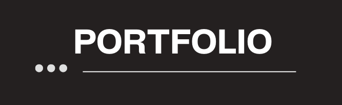

# Portifólio

> Portifólio é um aplicativo Frontend que exibe algumas das principais informações sobre minha carreira profissional com tecnólogia.
> Projeto desenvolvimento em NodeJS, Angular e Typescript.

     

## Índice

-   [Sobre](#sobre)
      - [Descrição](#descrição)
      - [Funcionalidades](#funcinalidades)
      - [Ferramentas utilizadas](#ferramentas-utilizadas)    
-   [Instalando](#instalando)
      -   [Instalando localmente](#instalando-localmente)
      -   [Instalação com Docker](#instalação-com-docker)
-   [Executando](#executando)
      -   [Linux](#executando-no-linux)
      -   [Windows](#executando-no-windows)

## Sobre
> Informações relevantes sobre o projeto

### Descrição

O Portifolio contempla de informações que julgo relevantes para conhecimento das minhas capacidades profissionais.

### Funcionalidades

:heavy_check_mark: `Funcionalidade 1:` Informações básicas e resumo

:heavy_check_mark: `Funcionalidade 2:` Informações de contato

:heavy_check_mark: `Funcionalidade 3:` Principais conhecimentos

:heavy_check_mark: `Funcionalidade 4:` Principais experiências

:heavy_check_mark: `Funcionalidade 5:` Principais projetos

## Instalando

> Como instalar projeto e suas dependências

### Instalando localmente

#### :leftwards_arrow_with_hook: Pré-requisitos

1. [NodeJS 18 ou superior](https://nodejs.org/en/download/) - _Interpretador que permite executar JS fora do navegador_
2. [Angular 17 ou superior](https://angular.io/cli) _(npm install -g @angular/cli)_ - _Ferramenta de desenvolvimento web_

#### :arrow_down: Baixando e Instalando

1. Baixe o projeto digitando no terminal 
    `git clone git@github.com:hc-pedrosouza/portifolio.git`
1. Abra a pasta do do projeto e digite no terminal 
    `npm i`

## :rocket: Executando

> Passo a passo de como executar o projeto

### Executando no Linux / OSX / Windows

  

1. Abra a pasta do projeto no terminal
1. No terminal:
    - Digite `npm run start`
1. No navegador
    - Acesse a URL -> **http://localhost:4200**